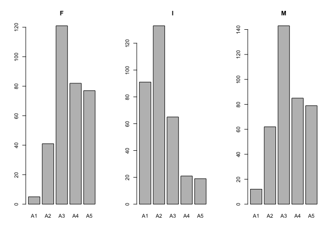
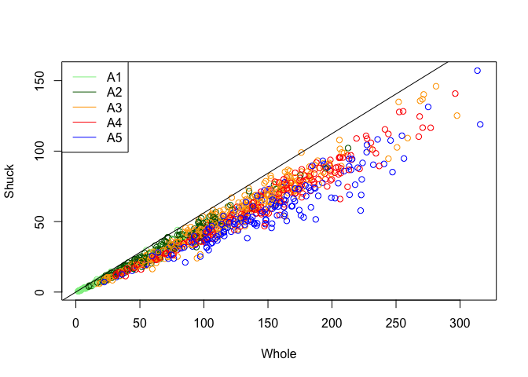
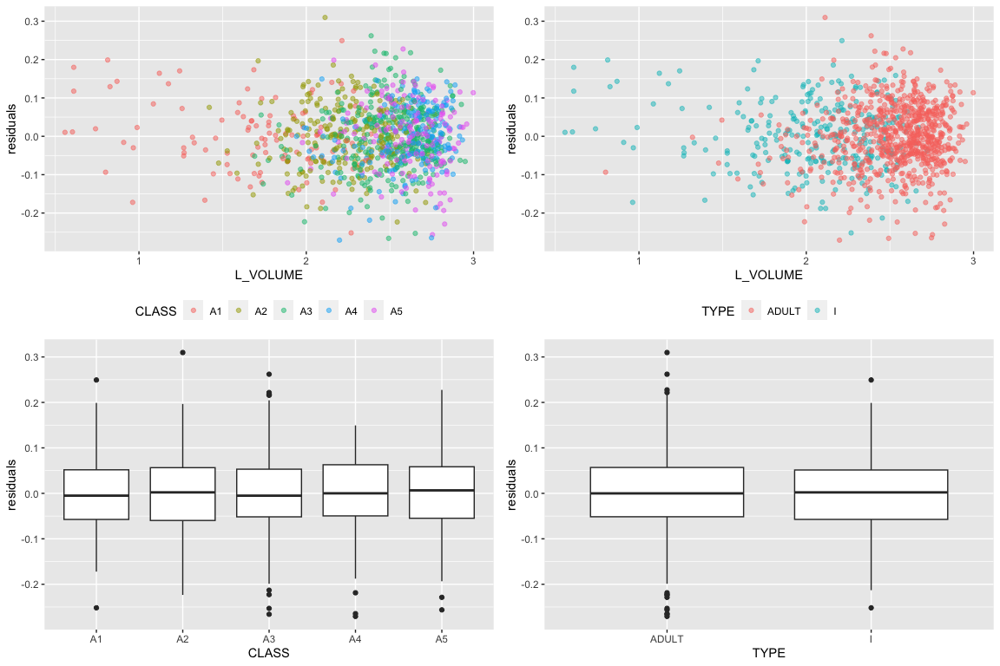

# Abalone Harvest Analysis

 Photo by [La
La](https://unsplash.com/@larrylam)

## Requirements

-   R
-   renv

## Environment set up

    renv::restore()

## Introduction

Abalones are an economic and recreational resource that is threatened by
a variety of factors which include: pollution, disease, loss of habitat,
predation, commercial harvesting, sport fishing and illegal harvesting.
Environmental variation and the availability of nutrients affect the
growth and maturation rate of abalones. Over the last 20+ years it is
estimated the commercial catch of abalone worldwide has declined in the
neighborhood of 40%. Abalones are easily over harvested because of slow
growth rates and variable reproductive success. Being able to quickly
determine the age composition of a regional abalone population would be
an important capability. The information so derived could be used to
manage harvesting requirements.

The data are derived from an observational study of abalones. The intent
of the investigators was to predict the age of abalone from physical
measurements thus avoiding the necessity of counting growth rings for
aging. Ideally, a growth ring is produced each year of age. Currently,
age is determined by drilling the shell and counting the number of shell
rings using a microscope. This is a difficult and time consuming
process. Ring clarity can be an issue. At the completion of the breeding
season sexing abalone can be difficult. Similar difficulties are
experienced when trying to determine the sex of immature abalone. The
study was not successful. The investigators concluded additional
information would be required such as weather patterns and location
which affect food availability.

I will analyze the data provided from this study further.

## 1. Data Preparation

------------------------------------------------------------------------

The structure of the data. We can see that there are 1,036 observations
(rows) and 8 variables (columns).

    ## 'data.frame':    1036 obs. of  8 variables:
    ##  $ SEX   : Factor w/ 3 levels "F","I","M": 2 2 2 2 2 2 2 2 2 2 ...
    ##  $ LENGTH: num  5.57 3.67 10.08 4.09 6.93 ...
    ##  $ DIAM  : num  4.09 2.62 7.35 3.15 4.83 ...
    ##  $ HEIGHT: num  1.26 0.84 2.205 0.945 1.785 ...
    ##  $ WHOLE : num  11.5 3.5 79.38 4.69 21.19 ...
    ##  $ SHUCK : num  4.31 1.19 44 2.25 9.88 ...
    ##  $ RINGS : int  6 4 6 3 6 6 5 6 5 6 ...
    ##  $ CLASS : Factor w/ 5 levels "A1","A2","A3",..: 1 1 1 1 1 1 1 1 1 1 ...

------------------------------------------------------------------------

The basic summary of the data with a table of Class vs Rings.

    ##  SEX         LENGTH           DIAM            HEIGHT          WHOLE        
    ##  F:326   Min.   : 2.73   Min.   : 1.995   Min.   :0.525   Min.   :  1.625  
    ##  I:329   1st Qu.: 9.45   1st Qu.: 7.350   1st Qu.:2.415   1st Qu.: 56.484  
    ##  M:381   Median :11.45   Median : 8.925   Median :2.940   Median :101.344  
    ##          Mean   :11.08   Mean   : 8.622   Mean   :2.947   Mean   :105.832  
    ##          3rd Qu.:13.02   3rd Qu.:10.185   3rd Qu.:3.570   3rd Qu.:150.319  
    ##          Max.   :16.80   Max.   :13.230   Max.   :4.935   Max.   :315.750  
    ##      SHUCK              RINGS        CLASS        VOLUME       
    ##  Min.   :  0.5625   Min.   : 3.000   A1:108   Min.   :  3.612  
    ##  1st Qu.: 23.3006   1st Qu.: 8.000   A2:236   1st Qu.:163.545  
    ##  Median : 42.5700   Median : 9.000   A3:329   Median :307.363  
    ##  Mean   : 45.4396   Mean   : 9.993   A4:188   Mean   :326.804  
    ##  3rd Qu.: 64.2897   3rd Qu.:11.000   A5:175   3rd Qu.:463.264  
    ##  Max.   :157.0800   Max.   :25.000            Max.   :995.673  
    ##      RATIO        
    ##  Min.   :0.06734  
    ##  1st Qu.:0.12241  
    ##  Median :0.13914  
    ##  Mean   :0.14205  
    ##  3rd Qu.:0.15911  
    ##  Max.   :0.31176

    ##     
    ##        3   4   5   6   7   8   9  10  11  12  13  14  15  16  17  18  19  20
    ##   A1   9   8  24  67   0   0   0   0   0   0   0   0   0   0   0   0   0   0
    ##   A2   0   0   0   0  91 145   0   0   0   0   0   0   0   0   0   0   0   0
    ##   A3   0   0   0   0   0   0 182 147   0   0   0   0   0   0   0   0   0   0
    ##   A4   0   0   0   0   0   0   0   0 125  63   0   0   0   0   0   0   0   0
    ##   A5   0   0   0   0   0   0   0   0   0   0  48  35  27  15  13   8   8   6
    ##     
    ##       21  22  23  24  25
    ##   A1   0   0   0   0   0
    ##   A2   0   0   0   0   0
    ##   A3   0   0   0   0   0
    ##   A4   0   0   0   0   0
    ##   A5   4   1   7   2   1

The variables being discussed here is SEX and CLASS. SEX contains male,
female, and infant. CLASS are ordered age classification based on RINGS
(A1=youngest, and A6= oldest). Overall, the distribution seems like it’s
following a normal distribution, but with a slight left skewness.
Potential outliers may be abalones that are considered infants in the A4
and A5 groups. Since A4 and A5 are older, their sex should have been
identified and it could be an error in the data.

    ##      
    ##         A1   A2   A3   A4   A5  Sum
    ##   F      5   41  121   82   77  326
    ##   I     91  133   65   21   19  329
    ##   M     12   62  143   85   79  381
    ##   Sum  108  236  329  188  175 1036

Female and male abalones are left skewed and infant abalones are right
skewed in the ordered class. This is most likely because it is harder to
identify the sex of younger abalones. The number of infant abalones
decrease as the age groups increase because the sex are identified in
older groups.

------------------------------------------------------------------------

Both plots have a positive correlation to whole. As age groups increase,
whole increases and the y variable of volume and shuck increase as well.
The first plot has A3-A5 scattered around the middle and top right part
of the graph. This behavior seems random without a clear trend. However,
for the second plot, we can observe certain trends. The younger groups
such as A1-A3 are much closer to the maximum line compared to the older
groups such A4-A5. It seems like as abalones age, the ratio of shuck to
whole starts to decrease. This is an interesting finding because the
first plot is a visualization of volume vs whole. Even though the volume
may increase as abalones age, that doesn’t mean the shuck will increase
as well.

------------------------------------------------------------------------

All three sexes are close to a normality. However, all 3 sexes seem to
be right skewed as we can observe from the histogram and qqplot. The
boxplot shows there are outliers in all 3 sexes above the upper extreme.

<table>
<colgroup>
<col style="width: 4%" />
<col style="width: 4%" />
<col style="width: 8%" />
<col style="width: 8%" />
<col style="width: 8%" />
<col style="width: 12%" />
<col style="width: 12%" />
<col style="width: 7%" />
<col style="width: 7%" />
<col style="width: 13%" />
<col style="width: 12%" />
</colgroup>
<thead>
<tr class="header">
<th style="text-align: left;"></th>
<th style="text-align: left;">SEX</th>
<th style="text-align: right;">LENGTH</th>
<th style="text-align: right;">DIAM</th>
<th style="text-align: right;">HEIGHT</th>
<th style="text-align: right;">WHOLE</th>
<th style="text-align: right;">SHUCK</th>
<th style="text-align: right;">RINGS</th>
<th style="text-align: left;">CLASS</th>
<th style="text-align: right;">VOLUME</th>
<th style="text-align: right;">RATIO</th>
</tr>
</thead>
<tbody>
<tr class="odd">
<td style="text-align: left;">3</td>
<td style="text-align: left;">I</td>
<td style="text-align: right;">10.080</td>
<td style="text-align: right;">7.350</td>
<td style="text-align: right;">2.205</td>
<td style="text-align: right;">79.37500</td>
<td style="text-align: right;">44.00000</td>
<td style="text-align: right;">6</td>
<td style="text-align: left;">A1</td>
<td style="text-align: right;">163.364040</td>
<td style="text-align: right;">0.2693371</td>
</tr>
<tr class="even">
<td style="text-align: left;">37</td>
<td style="text-align: left;">I</td>
<td style="text-align: right;">4.305</td>
<td style="text-align: right;">3.255</td>
<td style="text-align: right;">0.945</td>
<td style="text-align: right;">6.18750</td>
<td style="text-align: right;">2.93750</td>
<td style="text-align: right;">3</td>
<td style="text-align: left;">A1</td>
<td style="text-align: right;">13.242072</td>
<td style="text-align: right;">0.2218308</td>
</tr>
<tr class="odd">
<td style="text-align: left;">42</td>
<td style="text-align: left;">I</td>
<td style="text-align: right;">2.835</td>
<td style="text-align: right;">2.730</td>
<td style="text-align: right;">0.840</td>
<td style="text-align: right;">3.62500</td>
<td style="text-align: right;">1.56250</td>
<td style="text-align: right;">4</td>
<td style="text-align: left;">A1</td>
<td style="text-align: right;">6.501222</td>
<td style="text-align: right;">0.2403394</td>
</tr>
<tr class="even">
<td style="text-align: left;">58</td>
<td style="text-align: left;">I</td>
<td style="text-align: right;">6.720</td>
<td style="text-align: right;">4.305</td>
<td style="text-align: right;">1.680</td>
<td style="text-align: right;">22.62500</td>
<td style="text-align: right;">11.00000</td>
<td style="text-align: right;">5</td>
<td style="text-align: left;">A1</td>
<td style="text-align: right;">48.601728</td>
<td style="text-align: right;">0.2263294</td>
</tr>
<tr class="odd">
<td style="text-align: left;">67</td>
<td style="text-align: left;">I</td>
<td style="text-align: right;">5.040</td>
<td style="text-align: right;">3.675</td>
<td style="text-align: right;">0.945</td>
<td style="text-align: right;">9.65625</td>
<td style="text-align: right;">3.93750</td>
<td style="text-align: right;">5</td>
<td style="text-align: left;">A1</td>
<td style="text-align: right;">17.503290</td>
<td style="text-align: right;">0.2249577</td>
</tr>
<tr class="even">
<td style="text-align: left;">89</td>
<td style="text-align: left;">I</td>
<td style="text-align: right;">3.360</td>
<td style="text-align: right;">2.310</td>
<td style="text-align: right;">0.525</td>
<td style="text-align: right;">2.43750</td>
<td style="text-align: right;">0.93750</td>
<td style="text-align: right;">4</td>
<td style="text-align: left;">A1</td>
<td style="text-align: right;">4.074840</td>
<td style="text-align: right;">0.2300704</td>
</tr>
<tr class="odd">
<td style="text-align: left;">105</td>
<td style="text-align: left;">I</td>
<td style="text-align: right;">6.930</td>
<td style="text-align: right;">4.725</td>
<td style="text-align: right;">1.575</td>
<td style="text-align: right;">23.37500</td>
<td style="text-align: right;">11.81250</td>
<td style="text-align: right;">7</td>
<td style="text-align: left;">A2</td>
<td style="text-align: right;">51.572194</td>
<td style="text-align: right;">0.2290478</td>
</tr>
<tr class="even">
<td style="text-align: left;">200</td>
<td style="text-align: left;">I</td>
<td style="text-align: right;">9.135</td>
<td style="text-align: right;">6.300</td>
<td style="text-align: right;">2.520</td>
<td style="text-align: right;">74.56250</td>
<td style="text-align: right;">32.37500</td>
<td style="text-align: right;">8</td>
<td style="text-align: left;">A2</td>
<td style="text-align: right;">145.027260</td>
<td style="text-align: right;">0.2232339</td>
</tr>
<tr class="odd">
<td style="text-align: left;">350</td>
<td style="text-align: left;">F</td>
<td style="text-align: right;">7.980</td>
<td style="text-align: right;">6.720</td>
<td style="text-align: right;">2.415</td>
<td style="text-align: right;">80.93750</td>
<td style="text-align: right;">40.37500</td>
<td style="text-align: right;">7</td>
<td style="text-align: left;">A2</td>
<td style="text-align: right;">129.505824</td>
<td style="text-align: right;">0.3117620</td>
</tr>
<tr class="even">
<td style="text-align: left;">379</td>
<td style="text-align: left;">F</td>
<td style="text-align: right;">15.330</td>
<td style="text-align: right;">11.970</td>
<td style="text-align: right;">3.465</td>
<td style="text-align: right;">252.06250</td>
<td style="text-align: right;">134.89812</td>
<td style="text-align: right;">10</td>
<td style="text-align: left;">A3</td>
<td style="text-align: right;">635.827846</td>
<td style="text-align: right;">0.2121614</td>
</tr>
<tr class="odd">
<td style="text-align: left;">420</td>
<td style="text-align: left;">F</td>
<td style="text-align: right;">11.550</td>
<td style="text-align: right;">7.980</td>
<td style="text-align: right;">3.465</td>
<td style="text-align: right;">150.62500</td>
<td style="text-align: right;">68.55375</td>
<td style="text-align: right;">10</td>
<td style="text-align: left;">A3</td>
<td style="text-align: right;">319.365585</td>
<td style="text-align: right;">0.2146560</td>
</tr>
<tr class="even">
<td style="text-align: left;">421</td>
<td style="text-align: left;">F</td>
<td style="text-align: right;">13.125</td>
<td style="text-align: right;">10.290</td>
<td style="text-align: right;">2.310</td>
<td style="text-align: right;">142.00000</td>
<td style="text-align: right;">66.47062</td>
<td style="text-align: right;">9</td>
<td style="text-align: left;">A3</td>
<td style="text-align: right;">311.979938</td>
<td style="text-align: right;">0.2130606</td>
</tr>
<tr class="odd">
<td style="text-align: left;">458</td>
<td style="text-align: left;">F</td>
<td style="text-align: right;">11.445</td>
<td style="text-align: right;">8.085</td>
<td style="text-align: right;">3.150</td>
<td style="text-align: right;">139.81250</td>
<td style="text-align: right;">68.49062</td>
<td style="text-align: right;">9</td>
<td style="text-align: left;">A3</td>
<td style="text-align: right;">291.478399</td>
<td style="text-align: right;">0.2349767</td>
</tr>
<tr class="even">
<td style="text-align: left;">586</td>
<td style="text-align: left;">F</td>
<td style="text-align: right;">12.180</td>
<td style="text-align: right;">9.450</td>
<td style="text-align: right;">4.935</td>
<td style="text-align: right;">133.87500</td>
<td style="text-align: right;">38.25000</td>
<td style="text-align: right;">14</td>
<td style="text-align: left;">A5</td>
<td style="text-align: right;">568.023435</td>
<td style="text-align: right;">0.0673388</td>
</tr>
<tr class="odd">
<td style="text-align: left;">746</td>
<td style="text-align: left;">M</td>
<td style="text-align: right;">13.440</td>
<td style="text-align: right;">10.815</td>
<td style="text-align: right;">1.680</td>
<td style="text-align: right;">130.25000</td>
<td style="text-align: right;">63.73125</td>
<td style="text-align: right;">10</td>
<td style="text-align: left;">A3</td>
<td style="text-align: right;">244.194048</td>
<td style="text-align: right;">0.2609861</td>
</tr>
<tr class="even">
<td style="text-align: left;">754</td>
<td style="text-align: left;">M</td>
<td style="text-align: right;">10.500</td>
<td style="text-align: right;">7.770</td>
<td style="text-align: right;">3.150</td>
<td style="text-align: right;">132.68750</td>
<td style="text-align: right;">61.13250</td>
<td style="text-align: right;">9</td>
<td style="text-align: left;">A3</td>
<td style="text-align: right;">256.992750</td>
<td style="text-align: right;">0.2378764</td>
</tr>
<tr class="odd">
<td style="text-align: left;">803</td>
<td style="text-align: left;">M</td>
<td style="text-align: right;">10.710</td>
<td style="text-align: right;">8.610</td>
<td style="text-align: right;">3.255</td>
<td style="text-align: right;">160.31250</td>
<td style="text-align: right;">70.41375</td>
<td style="text-align: right;">9</td>
<td style="text-align: left;">A3</td>
<td style="text-align: right;">300.153640</td>
<td style="text-align: right;">0.2345924</td>
</tr>
<tr class="even">
<td style="text-align: left;">810</td>
<td style="text-align: left;">M</td>
<td style="text-align: right;">12.285</td>
<td style="text-align: right;">9.870</td>
<td style="text-align: right;">3.465</td>
<td style="text-align: right;">176.12500</td>
<td style="text-align: right;">99.00000</td>
<td style="text-align: right;">10</td>
<td style="text-align: left;">A3</td>
<td style="text-align: right;">420.141472</td>
<td style="text-align: right;">0.2356349</td>
</tr>
<tr class="odd">
<td style="text-align: left;">852</td>
<td style="text-align: left;">M</td>
<td style="text-align: right;">11.550</td>
<td style="text-align: right;">8.820</td>
<td style="text-align: right;">3.360</td>
<td style="text-align: right;">167.56250</td>
<td style="text-align: right;">78.27187</td>
<td style="text-align: right;">10</td>
<td style="text-align: left;">A3</td>
<td style="text-align: right;">342.286560</td>
<td style="text-align: right;">0.2286735</td>
</tr>
</tbody>
</table>

The majority of the outliers have a ratio above 0.22. There was 1
observation that had a ratio of 0.06 which made it as an outlier in the
lower extreme. Also, there were no outliers for abalones in the A4
class.

------------------------------------------------------------------------

Since there is a positive correlation between the variables, I think it
would do fairly well to predict the age. However, as age approaches the
A4 & A5 class, it would be difficult to classify because both groups
have similar boxplot stats for volume and whole.

------------------------------------------------------------------------

<table>
<thead>
<tr class="header">
<th style="text-align: left;"></th>
<th style="text-align: right;">A1</th>
<th style="text-align: right;">A2</th>
<th style="text-align: right;">A3</th>
<th style="text-align: right;">A4</th>
<th style="text-align: right;">A5</th>
</tr>
</thead>
<tbody>
<tr class="odd">
<td style="text-align: left;">F</td>
<td style="text-align: right;">255.29938</td>
<td style="text-align: right;">276.8573</td>
<td style="text-align: right;">412.6079</td>
<td style="text-align: right;">498.0489</td>
<td style="text-align: right;">486.1525</td>
</tr>
<tr class="even">
<td style="text-align: left;">I</td>
<td style="text-align: right;">66.51618</td>
<td style="text-align: right;">160.3200</td>
<td style="text-align: right;">270.7406</td>
<td style="text-align: right;">316.4129</td>
<td style="text-align: right;">318.6930</td>
</tr>
<tr class="odd">
<td style="text-align: left;">M</td>
<td style="text-align: right;">103.72320</td>
<td style="text-align: right;">245.3857</td>
<td style="text-align: right;">358.1181</td>
<td style="text-align: right;">442.6155</td>
<td style="text-align: right;">440.2074</td>
</tr>
</tbody>
</table>

<table>
<thead>
<tr class="header">
<th style="text-align: left;"></th>
<th style="text-align: right;">A1</th>
<th style="text-align: right;">A2</th>
<th style="text-align: right;">A3</th>
<th style="text-align: right;">A4</th>
<th style="text-align: right;">A5</th>
</tr>
</thead>
<tbody>
<tr class="odd">
<td style="text-align: left;">F</td>
<td style="text-align: right;">38.90000</td>
<td style="text-align: right;">42.50305</td>
<td style="text-align: right;">59.69121</td>
<td style="text-align: right;">69.05161</td>
<td style="text-align: right;">59.17076</td>
</tr>
<tr class="even">
<td style="text-align: left;">I</td>
<td style="text-align: right;">10.11332</td>
<td style="text-align: right;">23.41024</td>
<td style="text-align: right;">37.17969</td>
<td style="text-align: right;">39.85369</td>
<td style="text-align: right;">36.47047</td>
</tr>
<tr class="odd">
<td style="text-align: left;">M</td>
<td style="text-align: right;">16.39583</td>
<td style="text-align: right;">38.33855</td>
<td style="text-align: right;">52.96933</td>
<td style="text-align: right;">61.42726</td>
<td style="text-align: right;">55.02762</td>
</tr>
</tbody>
</table>

<table>
<thead>
<tr class="header">
<th style="text-align: left;"></th>
<th style="text-align: right;">A1</th>
<th style="text-align: right;">A2</th>
<th style="text-align: right;">A3</th>
<th style="text-align: right;">A4</th>
<th style="text-align: right;">A5</th>
</tr>
</thead>
<tbody>
<tr class="odd">
<td style="text-align: left;">F</td>
<td style="text-align: right;">0.1546644</td>
<td style="text-align: right;">0.1554605</td>
<td style="text-align: right;">0.1450304</td>
<td style="text-align: right;">0.1379609</td>
<td style="text-align: right;">0.1233605</td>
</tr>
<tr class="even">
<td style="text-align: left;">I</td>
<td style="text-align: right;">0.1569554</td>
<td style="text-align: right;">0.1475600</td>
<td style="text-align: right;">0.1372256</td>
<td style="text-align: right;">0.1244413</td>
<td style="text-align: right;">0.1167649</td>
</tr>
<tr class="odd">
<td style="text-align: left;">M</td>
<td style="text-align: right;">0.1512698</td>
<td style="text-align: right;">0.1564017</td>
<td style="text-align: right;">0.1462123</td>
<td style="text-align: right;">0.1364881</td>
<td style="text-align: right;">0.1262089</td>
</tr>
</tbody>
</table>

It seems volume and shuck follow a similar trend. As age increases, the
volume and shuck increases as well. The females have the highest average
volume and shuck in any age group for these 2 variables. However, when
it comes to ratio, it follows a different trend. As age increases, the
average ratio decreases. Also, the lines intersect frequently. In A1
groups, the infants have the highest ratio. After A2, the female and
male keeps intersecting. I wonder why the trend for the ratio are
inconsistent compared to volume and shuck. It makes me even wonder if
some of the abalones were correctly classified because there are
inconsistencies in the ratio.

We can suggest that as abalones age, the volume and whole increase.
Comparing the infant and adults, we can observe that the adults have
more variability as rings increases. The infants have a relatively small
variance compared to the adults.

------------------------------------------------------------------------

The biggest reason that the original study failed was because it was not
possible to completely predict the age of the abalone from the physical
measurements. Specifically, the age group of A4-A5 had identical sizes
which was difficult to differentiate. For the age groups in early ages
such as A1-A3, it may be possibly to predict the age with the physical
appearances.

I would inquire if there are certain groups that need to be considered.
For example, for studies related to health, age is an extremely
important variable. During the COVID pandemic, the [Simpson’s paradox
became a topic of
concern](https://www.lancaster.ac.uk/stor-i-student-sites/robyn-goldsmith/2021/04/02/being-careful-with-covid-19-statistics-simpsons-paradox/)
while analyzing the statistics of fatality rate and vaccine
effectiveness. I would inquire about any demographic information as
possible.

One of the most difficult elements of observational studies is that the
sample may not represent the population. For example, even though a
study used stratified sampling methods to gather data, the same results
may not hold true if the data was collected in an entirely different
environment (e.g., country, time of day/year, etc.). With observational
studies, correlation can possibly be determined, but not causality.
Determining causality would be extremely difficult and it will require
domain knowledge and critical thinking.

## 2. Data Analysis

------------------------------------------------------------------------

The structure of the data. We can see that there are 1,036 observations
(rows) and 10 variables (columns).

    ## 'data.frame':    1036 obs. of  10 variables:
    ##  $ SEX   : Factor w/ 3 levels "F","I","M": 2 2 2 2 2 2 2 2 2 2 ...
    ##  $ LENGTH: num  5.57 3.67 10.08 4.09 6.93 ...
    ##  $ DIAM  : num  4.09 2.62 7.35 3.15 4.83 ...
    ##  $ HEIGHT: num  1.26 0.84 2.205 0.945 1.785 ...
    ##  $ WHOLE : num  11.5 3.5 79.38 4.69 21.19 ...
    ##  $ SHUCK : num  4.31 1.19 44 2.25 9.88 ...
    ##  $ RINGS : int  6 4 6 3 6 6 5 6 5 6 ...
    ##  $ CLASS : Factor w/ 5 levels "A1","A2","A3",..: 1 1 1 1 1 1 1 1 1 1 ...
    ##  $ VOLUME: num  28.7 8.1 163.4 12.2 59.7 ...
    ##  $ RATIO : num  0.15 0.147 0.269 0.185 0.165 ...

    ## skewness: 0.714705598826372

    ## kurtosis: 4.66729775944278

    ## excess kurtosis: 1.66729775944278

    ## skewness: -0.0939154815619048

    ## kurtosis: 3.535430948318

    ## excess kurtosis: 0.535430948318001

    ## 
    ##  Bartlett test of homogeneity of variances
    ## 
    ## data:  mydata$RATIO by mydata$CLASS
    ## Bartlett's K-squared = 21.49, df = 4, p-value = 0.0002531

    ## 
    ##  Bartlett test of homogeneity of variances
    ## 
    ## data:  mydata$L_RATIO by mydata$CLASS
    ## Bartlett's K-squared = 3.1891, df = 4, p-value = 0.5267

L\_RATIO (log ratio) exhibits a better conformance to a normal
distribution with homogeneous variances across age. The skewness is
close to 0 which indicates it’s a symmetrical distribution. The kurtosis
is also close to 3 which indicates it is mesokurtic and resembles a
normal distribution peak. We can visually see this with the histogram
and qqplot as well. We can also see that the L\_RATIO have homogeneous
variances across ages with the Barlett test. Since the p-value is much
greater than 0.05, we fail to reject the null hypothesis of having
identical variances. On the other hand, the RATIO has p-value of
0.0002531 for the Barlett test which indicates that the variances are
not homogeneous across ages.

    ##               Df Sum Sq Mean Sq F value  Pr(>F)    
    ## CLASS          4  1.055 0.26384  38.370 < 2e-16 ***
    ## SEX            2  0.091 0.04569   6.644 0.00136 ** 
    ## CLASS:SEX      8  0.027 0.00334   0.485 0.86709    
    ## Residuals   1021  7.021 0.00688                    
    ## ---
    ## Signif. codes:  0 '***' 0.001 '**' 0.01 '*' 0.05 '.' 0.1 ' ' 1

    ##               Df Sum Sq Mean Sq F value  Pr(>F)    
    ## CLASS          4  1.055 0.26384  38.524 < 2e-16 ***
    ## SEX            2  0.091 0.04569   6.671 0.00132 ** 
    ## Residuals   1029  7.047 0.00685                    
    ## ---
    ## Signif. codes:  0 '***' 0.001 '**' 0.01 '*' 0.05 '.' 0.1 ' ' 1

While we get statistically significant results with CLASS and SEX
independently, that is not the case when we factor CLASS and SEX. We can
say there is an interaction effect between these two independent
variables. Since both of these variables affects the outcome of
L\_RATIO, we inevitably get a non-significant result when these two are
interacting.

    ##   Tukey multiple comparisons of means
    ##     95% family-wise confidence level
    ## 
    ## Fit: aov(formula = L_RATIO ~ CLASS + SEX, data = mydata)
    ## 
    ## $CLASS
    ##              diff         lwr          upr     p adj
    ## A2-A1 -0.01248831 -0.03876038  0.013783756 0.6919456
    ## A3-A1 -0.03426008 -0.05933928 -0.009180867 0.0018630
    ## A4-A1 -0.05863763 -0.08594237 -0.031332896 0.0000001
    ## A5-A1 -0.09997200 -0.12764430 -0.072299703 0.0000000
    ## A3-A2 -0.02177176 -0.04106269 -0.002480831 0.0178413
    ## A4-A2 -0.04614932 -0.06825638 -0.024042262 0.0000002
    ## A5-A2 -0.08748369 -0.11004316 -0.064924223 0.0000000
    ## A4-A3 -0.02437756 -0.04505283 -0.003702280 0.0114638
    ## A5-A3 -0.06571193 -0.08687025 -0.044553605 0.0000000
    ## A5-A4 -0.04133437 -0.06508845 -0.017580286 0.0000223
    ## 
    ## $SEX
    ##             diff          lwr           upr     p adj
    ## I-F -0.015890329 -0.031069561 -0.0007110968 0.0376673
    ## M-F  0.002069057 -0.012585555  0.0167236691 0.9412689
    ## M-I  0.017959386  0.003340824  0.0325779478 0.0111881

We can identify many statistically significant results from different
age groups. The only non-significant result we observe was from A2-A1.
This indicates that as the abolone’s age group change (besides from A1
to A2), the L\_RATIO will change as well. Male and female abalones can
be combined into a single category because both have significant
differences from infants and we have an extremely high adjusted p-value
which suggests there is no difference between male and female.

    ## 
    ## ADULT     I 
    ##   707   329

    ## `stat_bin()` using `bins = 30`. Pick better value with `binwidth`.

Infants have a right skewed distribution compared to adults. It would be
hard to separate infants and adults around the lower volume areas, since
there are a lot of overlaps in the two distributions (especially volumes
under 300). For larger volumes, it may be easier to separate infants and
adults. For volumes over 500, most of the abalones tend to be adults.

The log-transformation reduces the variability of the relationship
between volume and shuck we can make a better distinction between
groups. We can see that there is a positive correlation between volume
and shuck. For class levels, we can observe that the younger age groups,
especially the A1 groups, are separated from the rest. We can observe
that in general, when age groups increase, the shuck and volume increase
as well. This observation is replicated in the type level. Most of the
infants are scattered around the lower end of the volume and shuck. The
adults are scattered around the higher end of the volume and shuck.

    ## 
    ## ADULT     I 
    ##   747   289

    ## 
    ## Call:
    ## lm(formula = L_SHUCK ~ L_VOLUME + CLASS + TYPE, data = mydata)
    ## 
    ## Residuals:
    ##       Min        1Q    Median        3Q       Max 
    ## -0.270634 -0.054287  0.000159  0.055986  0.309718 
    ## 
    ## Coefficients:
    ##              Estimate Std. Error t value Pr(>|t|)    
    ## (Intercept) -0.796418   0.021718 -36.672  < 2e-16 ***
    ## L_VOLUME     0.999303   0.010262  97.377  < 2e-16 ***
    ## CLASSA2     -0.018005   0.011005  -1.636 0.102124    
    ## CLASSA3     -0.047310   0.012474  -3.793 0.000158 ***
    ## CLASSA4     -0.075782   0.014056  -5.391 8.67e-08 ***
    ## CLASSA5     -0.117119   0.014131  -8.288 3.56e-16 ***
    ## TYPEI       -0.021093   0.007688  -2.744 0.006180 ** 
    ## ---
    ## Signif. codes:  0 '***' 0.001 '**' 0.01 '*' 0.05 '.' 0.1 ' ' 1
    ## 
    ## Residual standard error: 0.08297 on 1029 degrees of freedom
    ## Multiple R-squared:  0.9504, Adjusted R-squared:  0.9501 
    ## F-statistic:  3287 on 6 and 1029 DF,  p-value: < 2.2e-16

The summary here shows the reference level of class as A1 and type as
adult. The coefficients for classes A2-A5 are the differences associated
with A1 and adult. We can imply that the classes A1-A5 are highly
correlated variables. When we plotted the data in the scatter plot
earlier, it showed positive correlation for volume and shuck for all
classes A1-A5 independently. However, when we fit the model and
considered all the predictor variables together, we can see that the
classes A2-A5 have a negative effect. The coefficients shows that if the
data belongs to a class in A2-A5 and holding every other predictors
constant, it will have a negative effect when the reference class is A1
and reference type is adult.

Compared to class, type is not as an important predictor for shuck. The
coefficient are much smaller compared to most of the other classes.
However, it is important to keep in mind that the dependent variable is
in log 10 scale. This means that even though it may be a small
coefficient, it still can influence the results greatly.

------------------------------------------------------------------------

    ## skewness: -0.0594523446253668

    ## kurtosis: 3.34330818394132

    ## excess kurtosis: 0.343308183941319

    ## 
    ##  Bartlett test of homogeneity of variances
    ## 
    ## data:  tempdf$residuals by tempdf$CLASS
    ## Bartlett's K-squared = 3.6882, df = 4, p-value = 0.4498

    ## 
    ##  Bartlett test of homogeneity of variances
    ## 
    ## data:  tempdf$residuals by tempdf$TYPE
    ## Bartlett's K-squared = 0.31156, df = 1, p-value = 0.5767

With the above calculations, we checked the assumptions of linear
regression. We checked if the residuals were normally distributed and
tested the homogeneity of variance of the residuals across classes. Both
of these assumptions were met. We can also observe that volume and shuck
have a linear relationship from 3(b) and we know each abalones are
independent from each other. Therefore, this model indeed fit the
dataset and it may be useful for harvesting decisions.

------------------------------------------------------------------------

Harvest Strategy:

There is a tradeoff faced in managing abalone harvest. The infant
population must be protected since it represents future harvests. On the
other hand, the harvest should be designed to be efficient with a yield
to justify the effort. This assignment will use VOLUME to form binary
decision rules to guide harvesting. If VOLUME is below a “cutoff”
(i.e. a specified volume), that individual will not be harvested. If
above, it will be harvested. Different rules are possible.The Management
needs to make a decision to implement 1 rule that meets the business
goal.

------------------------------------------------------------------------

    ## [1] 526.6383

    ## [1] 0.2476573

    ## [1] 0

    ## [1] 133.8214

    ## [1] 0.4982699

    ## [1] 0.9330656

    ## [1] 384.5584

    ## [1] 0.02422145

    ## [1] 0.4993307

    ## 
    ## Attaching package: 'reshape2'

    ## The following object is masked from 'package:tidyr':
    ## 
    ##     smiths

We can clearly observe a difference in median between infants and
adults. There will be a trade off of trying to preserve as much infants
versus trying to harvest as much adults as possible. Since we want to
save as much infants as possible, we don’t want to choose the median
infant point as the cut off. This would harvest roughly half of all
infants which would have a negative effect on future harvests. Choosing
the median adult point as the cut off would be the better option because
it would still save roughly 97.6% of all infants while harvesting half
of all adults. There needs to be a business decision made based on the
choosing the right cut off point for the business.

------------------------------------------------------------------------

More harvest strategies:

This part will address the determination of a cutoff volume.value
corresponding to the observed maximum difference in harvest percentages
of adults and infants. In other words, we want to find the volume value
such that the vertical distance between the infant curve and the adult
curve is maximum. To calculate this result, the vectors of proportions
from item (6) must be used. These proportions must be converted from
“not harvested” to “harvested” proportions by using (1 - prop.infants)
for infants, and (1 - prop.adults) for adults. The reason the proportion
for infants drops sooner than adults is that infants are maturing and
becoming adults with larger volumes.

------------------------------------------------------------------------

    ## [1] 0.7416332

    ## [1] 0.7416332

    ## [1] 0.1764706

    ## [1] 0.1764706

------------------------------------------------------------------------

    ## [1] 0.2871972

    ## [1] 0.8259705

    ## [1] 0.8666894

    ## [1] 0.246

    ## [1] 0.1785714

    ##                      Volume     TPR     FPR totalHarvest
    ## Protect all infants 526.600   0.246   0.000        0.180
    ## Median infants      133.800   0.933   0.498        0.813
    ## Median adults       384.600   0.499   0.024        0.367
    ## Max difference      262.100   0.742   0.176        0.584
    ## Zero A1 infants     206.800   0.826   0.287        0.676

There are various thresholds depending on the cutoff volume and there
are trade offs. Protect all infants is the most conservative threshold
with only harvesting volumes that are equal or greater than 526.8.
Because this method is protecting all infants, the FPR is 0, but TPR is
limited to 0.246 as well. This will leave out many adult abalones that
should have been harvested in order to protect all infants. The median
infants, on the other hand, have a very aggressive cutoff volume at
133.8. This method has a high TPR in 0.933, but has a FPR of 0.498. This
method harvests roughly half of infant abalones that shouldn’t have been
harvested in order to harvest more adults. The median adults, max
difference, and zero A1 infants are in between the 2 extreme cutoff
points. The business needs to make a decision based on the trade offs of
harvesting the abalones now or keeping them for the future.
